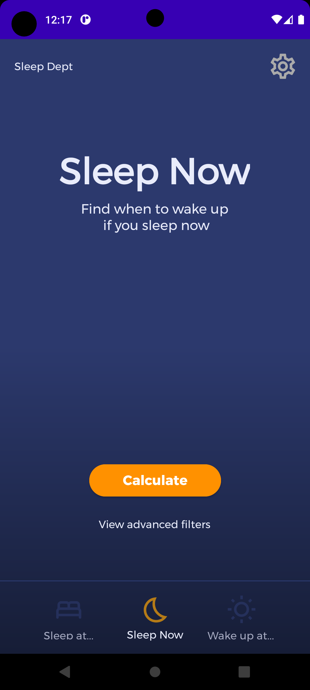
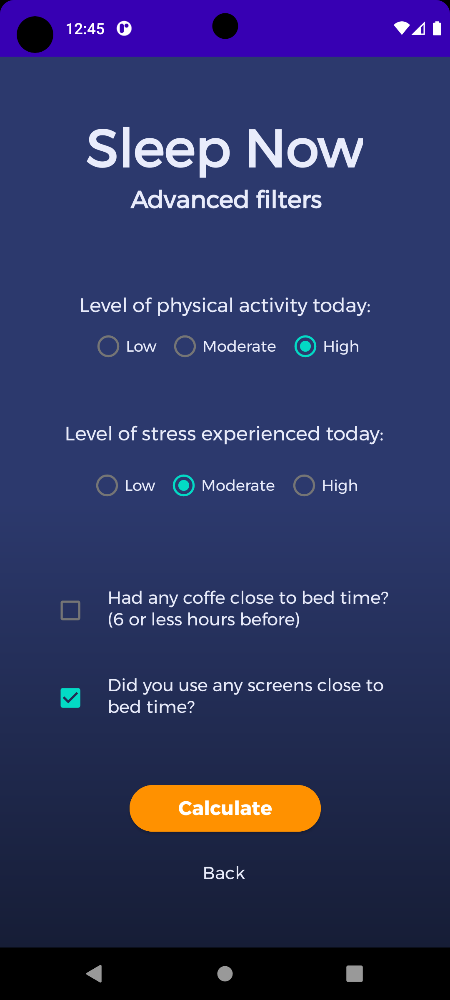
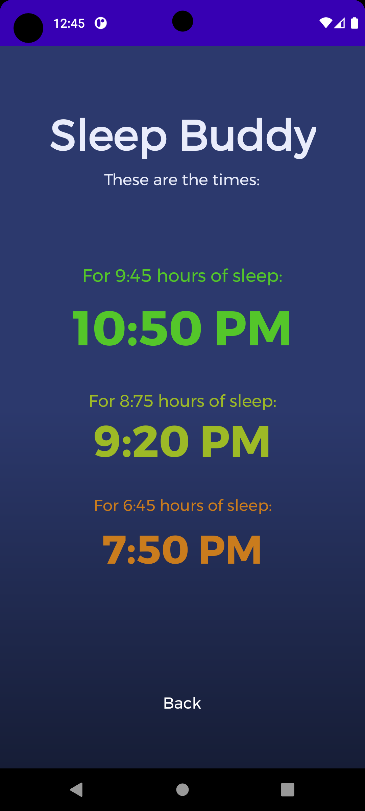
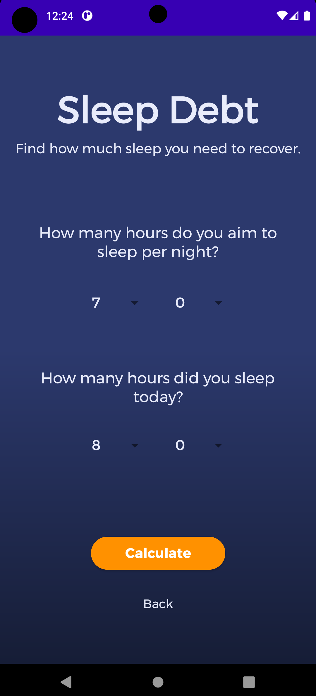
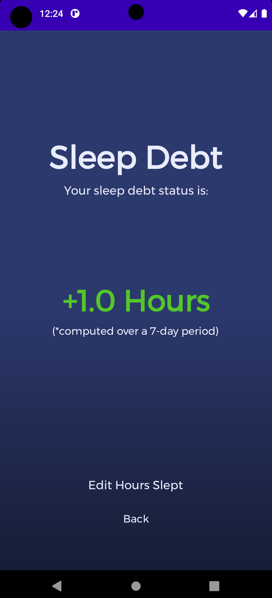

# Sleep Buddy - Your fellow sleep companion  
Sleep Buddy is an intuitive android app that uses sleep cycles to tell you the optimal times to go to bed in order to wake up refreshed!
***-Now with a Sleep Debt calculator!***

Sleep Buddy uses the science of sleep cycles as well as other factors individual to each user, such as age, stress levels or physical activity, to compute and recommend optimal wake-up times based on the time the user wishes to go to bed at.

Written in *Java* using *Android Studio* and *SQLite*

## Screenshots
-Initial user setup and main screen-

 

-Advanced filters and sleep calculation-

**Times were computer at 12:45 AM*

  

-***NEW:*** Sleep Debt calculator-

  
